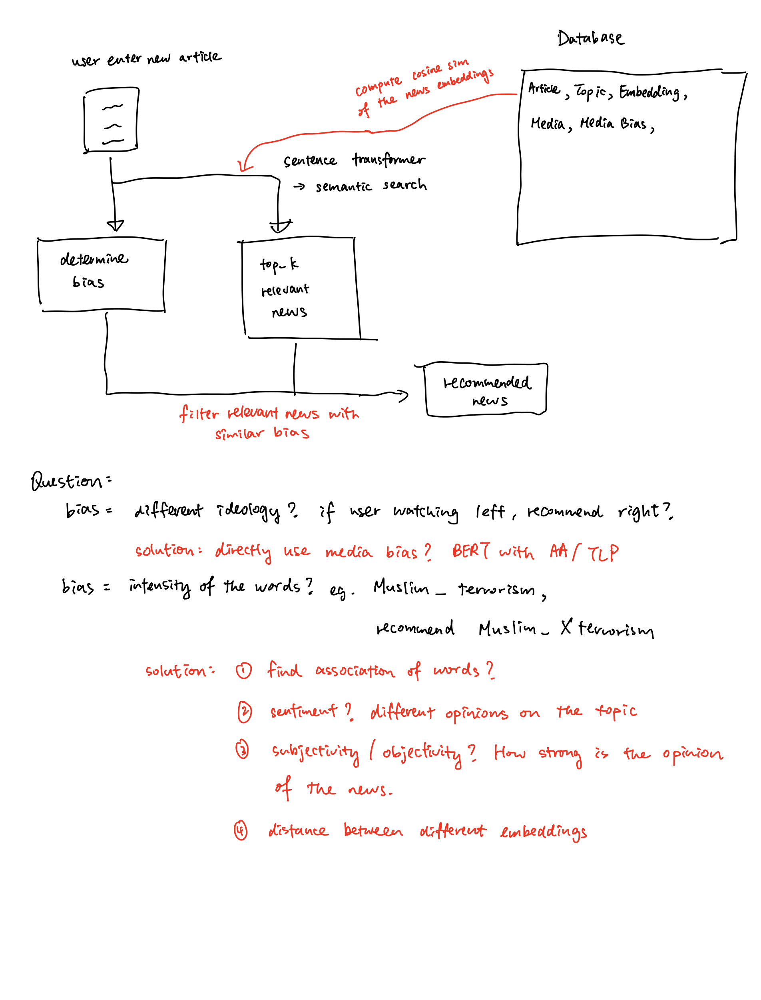

# UROP 1100
---
## Week 1 (17/3 - 24/3)

### **To-Do:**
1. News Topic Classification

2. Deploy ML Model on cloud

### **Datasets:**

|                                 |                                                               |
|---------------------------------|---------------------------------------------------------------|
| *News_Category_Dataset_v2.json* | kaggle dataset which contains over 200k data with 41 categories                 |
| *AG_NEWS*                       | pytorch dataset which contains 120k train data with 4 classes |
| *20newsgroups*                  | sklearn dataset which contains 19k data with 20 classes       |

### **Tested Models:**
- TFIDF with sklearn models (SVM, Ridge Regression, Logistic Regression, CNB)
- **goals:** 
    * high accuracy with short testing time
- **results:** 
    * SVM, ridge regression and logistic regression shows the best results with low test time
    * for the whole text: ~0.9 accuracy
    * for the headline: ~0.6 accuracy
- **limitations:** 
    * without hyperparameters tuning
    * without preprocessing text
- **ongoing:** 
    * sentence transformer (pretrained word embeddings) + MLP/CNN/LSTM 

### **Amazon Sagemaker**
- looked into Amazon Sagemaker
- tried to use notebook instance and s3 buckets
- **in-built algorithms:**
    * [blazing text](https://docs.aws.amazon.com/sagemaker/latest/dg/algos.html) 

### **Next week plan**
1. Continue to try pytorch sentence transformer + MLP/CNN/LSTM
2. Look into training and deploying models in Sagemaker
3. Try Amazon in-built algorithms

### **Questions**
1. Should the input of the topic classification be the headline or the whole text?
2. Do you prefer more traditional sklearn-type models or the state-of-the-art nn models? 
3. When should I move on to the next part?

---

## Week 2 (24/3 - 31/3)

### **To-Do:**
1. Finish Topic Classification

### **Tested Models:**
- **BlazingText Algo from Sagemaker**
    * training
    * deployment
- **Results:** 
    * validation score: 0.67 after 20 epoches
- **Improvements to be made:** 
    * current dimension of the embedding layer = 10, could set higher to get a more accurate result
    * merge 41 categories to a smaller number of categories
    * looking at the top k results?
- **Target**
    * 0.85 or above

### **Next week plan**
1. Improvements to the blazingtext algorithm
2. Distinguish the categories that are needed to be de-polarize
3. Looking into finding the polarity of the news article
4. Estimate the cost of SageMaker
5. Compute testing time

### **Questions**
1. Billing of AWS?
2. Suggestions on finding the polarity?

---

## Week 3 (31/3 - 7/4)

### **To-Do:**
1. Improvements on Topic Classification
2. Estimate testing time and the cost of SageMaker
3. Find Dataset with multiple sources and find the source bias

### **Progress:**
1. **Estimated cost of Sagemaker**
    - 41 USD for 24-7 Deployment (2 cpu, 4 gb ram)
2. **Topic Classification**
    - BlazingText Algorithm
    - Switch to SVM for testing
3. **Prediction Time**
    - 85 sec for 130k 800-word news
    - ~0.0007 sec for an article (?)
4. **Found Dataset**
    -[143000 articles from 15 American Publication](https://www.kaggle.com/datasets/snapcrack/all-the-news)
    
5. **Media Bias**
    - Media Bias Chart: Need license
    - [AllSides](https://www.allsides.com/media-bias/ratings)
    - Scrap media bias based on the input media (10 sec for 15 media)
    - Flow:
        - User enter webpage
        - Determine the media and scrap the content
        - Topic classification and get media bias (Total: <1 sec)

5. **Exploration**
    - After seperating their bias and classify topics
    - Wordcloud on left bias and right bias

### **Questions**
1. Content Bias: what models should I use? Should I capture words?
    - Wordcloud performance
2. Scalability:
    - for politics, we are seperating left or right.
    ` Other topics? sperating in terms of agree or disagree a certain topic? 

---

## Week 4,5 (7/4 - 21/4)

### **To-Do:**
1. Research
2. Design Flow

### Research Findings:
1. [Predicting the Political Ideology of News Articles](https://arxiv.org/pdf/2010.05338.pdf)
    - Use **LSTM** and **BERT** to predict the political bias
    - To remove media bias: 
        - **Adversarial Adaptation** (minimize the loss for both label predictor and media classifier)
        - **Triplet Loss Pre-training** (anchor, positive: *different source, same ideology*, negative: *same source, different ideology*)

2. [biased-sents-annotation](https://github.com/skymoonlight/biased-sents-annotation)
    - [source](https://aclanthology.org/2020.lrec-1.184.pdf)
    - a dataset that includes labelled article bias and sentence bias
    - limitation: only covers 4 events

3. [Political Depolarization of News Articles Using Attribute-aware Word Embeddings](https://arxiv.org/pdf/2101.01391.pdf)
    - **polarity of the word**: distance between its embeddings in different idelogy attributes
    - replace the polarized word to another word

### Flow:

### Test:
1. **Semantic Search**